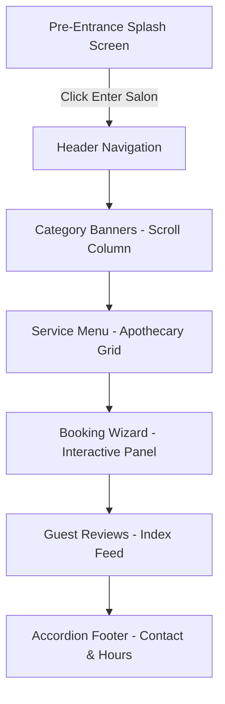

# Gilded Nail Bar - Developer & Agent Skills Guide (`Skills.md`)

This document establishes the technical blueprint, architectural design guardrails, data schemas, and operations procedures for the **Gilded Nail Bar** web application. Any developer or AI coding assistant working on this codebase must read and strictly adhere to these standards.

---

## 1. Brand Identity & Visual Design Guardrails

The website is designed with a **raw, high-end, wabi-sabi minimalist aesthetic**, inspired by apothecary branding (specifically Le Labo Fragrances). The design leans on physical textures, clean geometric splits, thin high-contrast borders, and spacious, high-contrast typography.

### 1.1 Color Tokens
All styling must strictly map to these custom CSS properties:
*   **Cream Silk (`--bg-brand: #f8efe1`)**: The primary backdrop color. Extracted from the official logo background.
*   **Warm Beige (`--bg-secondary: #f2ebe0`)**: Used for selected states, background shading, and highlights.
*   **Stone Grey (`--bg-concrete: #eae3d7`)**: A neutral concrete slate color used for raw texture representation (e.g., footer backgrounds and divider blocks).
*   **Earthy Bronze-Brown (`--color-text: #584638`)**: The primary text, line, and border color. Extracted from the official logo text.
*   **Muted Taupe (`--color-muted: #8a7c71`)**: Used for descriptions, labels, and secondary visual elements.

### 1.2 Typography Rules
Three distinct Google Fonts are loaded in `index.html` to establish the visual hierarchy:
1.  **IBM Plex Mono (Monospace)**: Establishes the "typewriter label-maker" print aesthetic. Use strictly in all-caps for labels, category numbers (e.g., `01 / MANICURES`), price tags, button texts, calendar cells, dates, and form labels.
2.  **Cormorant Garamond (Serif)**: Establishes a classic, sophisticated high-fashion feel. Use for category titles and main headings. Must be styled italicized (`font-style: italic`) to match brand guidelines.
3.  **Inter (Sans-serif)**: Ensures readable body copy. Use for paragraphs, item descriptions, input placeholders, and text fields.

### 1.3 Borders & Spacing
*   Do **not** use border-radius curves (use `border-radius: 0`).
*   Do **not** use smooth colorful gradients or radial halos (e.g., "aurora glows").
*   Use thin, solid, dark borders (`1px solid #584638` or transparent alpha lines `rgba(88, 70, 56, 0.25)`) to frame forms, calendar cards, and service items.

---

## 2. Page Architecture & Component Map

The application is built as a single-page app (SPA). The sections are laid out as a vertical column sequence:



### 2.1 Pre-Entrance Splash (`#splash-screen`)
*   Contains the centered brand logo and a dropdown containing the active salon location.
*   Fades out completely by appending the `.fade-out` class in JavaScript.
*   Uses `sessionStorage` (`gilded_entered`) to prevent re-blocking the user on subsequent tab reloads.

### 2.2 Category Heroes (`.category-hero`)
*   Four vertical segments representing the main menus.
*   Features high-quality atmospheric imagery with a subtle sepia/brightness overlay filter.
*   Contains a centered quick-explore button (`.cat-btn-explore`) that filters the catalog tabs and smooth-scrolls down to the catalog grid.

### 2.3 Apothecary Catalog Grid (`#services-grid`)
*   Displays service cards dynamically via `app.js`.
*   Includes a skeleton shimmer loading sequence (`.skeleton-card`) that delays for 350ms to simulate network latency and deliver a premium transition.

### 2.4 Interactive Booking Wizard (`.booking-container`)
*   Coordinates booking selections sequentially:
    *   **Step 1**: Select Service (updates checked cards).
    *   **Step 2**: Choose Stylist (lists specific stylists or "First Available").
    *   **Step 3**: Select Date & Time (interactive calendar and time slot buttons).
    *   **Step 4**: Enter Contact Details (personal form fields).
*   Generates a typewriter confirmation receipt modal (`#receipt-modal`) upon success.

### 2.5 Reviews Feed (`#reviews-feed`)
*   Recalculates average star rating aggregates dynamically in the summary block.
*   Syndicates local guest reviews from storage directly into index-card styled templates.

### 2.6 Accordion Footer (`.main-footer`)
*   In desktop mode, displays links and business hours in columns.
*   In mobile view (`@media (max-width: 768px)`), triggers accordion expansion drawers when clicking the column buttons, ensuring access to contact details and store timings.

---

## 3. Data Schema & State Management

The frontend state and client-side database stubs are managed in `app.js` using local storage persistence syncs.

### 3.1 Local State Schema
The current wizard progress is tracked in the `bookingState` object:
```javascript
let bookingState = {
    step: 1, // 1 to 4
    service: { id: 'srv-gilded-mani', name: 'Signature Gilded Manicure', price: 120, duration: '60 mins' },
    stylist: { id: 'sty-amara', name: 'Amara King', role: 'Master Nail Stylist' },
    date: Date(), // JavaScript Date object
    time: '1:45 PM',
    client: {
        name: 'Elena Rostova',
        email: 'elena@example.com',
        phone: '(214) 555-0145',
        notes: 'Likes minimalist gold foil designs'
    }
};
```

### 3.2 Mock Supabase Storage Keys
To simulate database connectors, `localStorage` stores stringified JSON payloads:
*   `gilded_services`: Array of nail treatments.
*   `gilded_reviews`: Array of submitted testimonials.
*   `gilded_appointments`: Array of confirmed booking objects.

#### Appointment Schema Example:
```json
{
  "id": "appt-x8h3k9m2a",
  "service_id": "srv-gilded-mani",
  "service_name": "Signature Gilded Manicure",
  "stylist_id": "sty-amara",
  "stylist_name": "Amara King",
  "date": "2026-06-18T00:00:00.000Z",
  "time": "1:45 PM",
  "client_name": "Elena Rostova",
  "client_email": "elena@example.com",
  "client_phone": "(214) 555-0145",
  "notes": "Minimalist gold foil design"
}
```

---

## 4. Automation Integrations (Zapier Dispatcher)

The application simulates external automated notifications via a webhook dispatcher:
*   **Endpoint Address**: `https://hooks.zapier.com/hooks/catch/123456/abcde`
*   **Trigger Event**: `appointment_created`
*   **Webhook Payload**: Transmits the confirmed appointment schema details to sync client calendars or dispatch automated email/SMS reminders.
*   *For production setup*: Swap the placeholder webhook URL in `app.js` under the `triggerBookingConfirmation` function.

---

## 5. Operations & Development Checklist

### 5.1 Local Server execution
Run a simple HTTP server in the project folder to enable correct file resolution and visual assets display:
```powershell
# Run using Python
python -m http.server 8000
```
Open browser address: `http://localhost:8000`.

### 5.2 Asset Files Map
Verify that these visual assets exist in the root directory:
*   `gilded_logo.png` - Centered serif header logo on beige background.
*   `salon_interior.png` - Splash page wabi-sabi salon interior backdrop.
*   `manicure_aesthetic.png` - Manicures category background image.
*   `pedicure_aesthetic.png` - Pedicures category background image.
*   `extensions_aesthetic.png` - Extensions category background image.
*   `nailart_aesthetic.png` - Nail Art category background image.

### 5.3 Mobile Responsive Testing
When reviewing responsive layout updates, verify:
*   Hamburger toggle expands mobile links (`#nav-menu`) cleanly below the header.
*   Services grid wraps to a single column.
*   Date picker calendar wraps to fit screens down to `320px` width.
*   Footer accordions collapse panels and arrow icons transition smoothly when toggled.

---

## 6. Accessibility & SEO Compliance Standards

Developers must maintain the project's high accessibility and SEO audit profiles:

### 6.1 Contrast & Readability
*   **Contrast Ratio**: The primary Earthy Bronze-Brown text (`#584638`) on the Cream Silk background (`#f8efe1`) yields a contrast ratio of **5.1:1**, which exceeds the WCAG AA requirement of **4.5:1** for normal text.
*   Alternating cards (using `#f2ebe0` or `#eae3d7`) must be verified to ensure contrast ratios do not dip below the 4.5:1 threshold.

### 6.2 ARIA Semantics
*   **Progress Indicators**: The wizard steps container (`#booking-progress-bar`) is marked with `role="progressbar"` and contains active values mapping to progress steps.
*   **Toggles & Modals**: Ensure `aria-expanded` attributes are bound to buttons (like `#mobile-toggle` and `.footer-accordion-btn`) and `aria-hidden` attributes map correctly to modal state changes.

### 6.3 SEO Meta Elements
*   Keep page headings hierarchical (exactly one single `<h1>` tag in `index.html` logo label, followed by `<h2>` section titles).
*   Always define unique and descriptive `id` attributes on all dynamic selectors, buttons, and input fields to assist browser-based automation tests and search indexing crawlers.

---

## 7. Performance & Caching Rules

To ensure rapid load times in mobile connections:
*   **Image Caching**: Set long cache-control headers on static images.
*   **Lazy Loading**: The first category hero (`#category-manicures`) uses standard eager loading. All lower hero blocks and footer elements should implement `loading="lazy"` on background assets if structured as direct image tags.
*   **Asset Weights**: Keep PNG assets compressed under **1MB** where possible using modern compression standards.

---

## 8. Live Backend Migration Guide

To transition this project from simulated stubs to active production servers, execute these steps:

### 8.1 Database Migration (Supabase integration)
1.  Initialize your Supabase Client library in the HTML head.
2.  In `app.js`, replace `mockSupabase` operations with the initialized client:
    ```javascript
    // Replace mock object reference
    const supabase = supabase.createClient('YOUR_SUPABASE_URL', 'YOUR_SUPABASE_ANON_KEY');
    ```
3.  Ensure database tables are structured with schemas matching the stubs:
    *   `services`: Columns (`id`, `name`, `category`, `price`, `duration`, `description`).
    *   `reviews`: Columns (`name`, `rating`, `text`, `date`).
    *   `appointments`: Columns (`id`, `service_id`, `service_name`, `stylist_id`, `stylist_name`, `date`, `time`, `client_name`, `client_email`, `client_phone`, `notes`).

### 8.2 Webhook Dispatcher
*   Provide the live URL endpoint generated in your Zapier or Make.com dashboard:
    ```javascript
    // In app.js (triggerBookingConfirmation function)
    await zapier.triggerWebhook('https://hooks.zapier.com/hooks/catch/YOUR_PRODUCTION_ID', payload);
    ```
